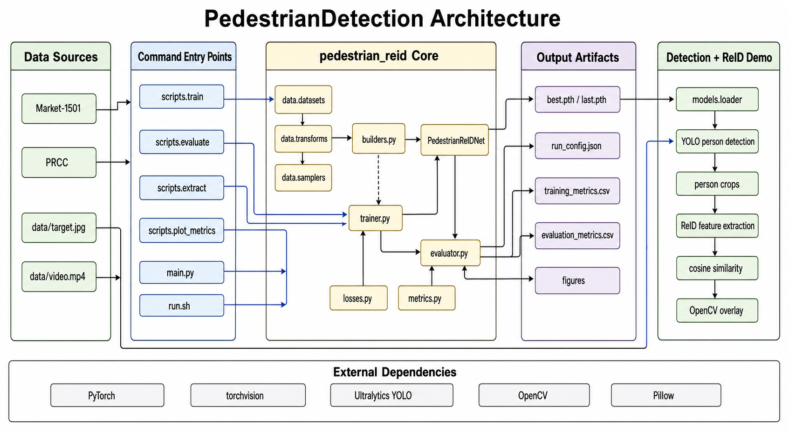
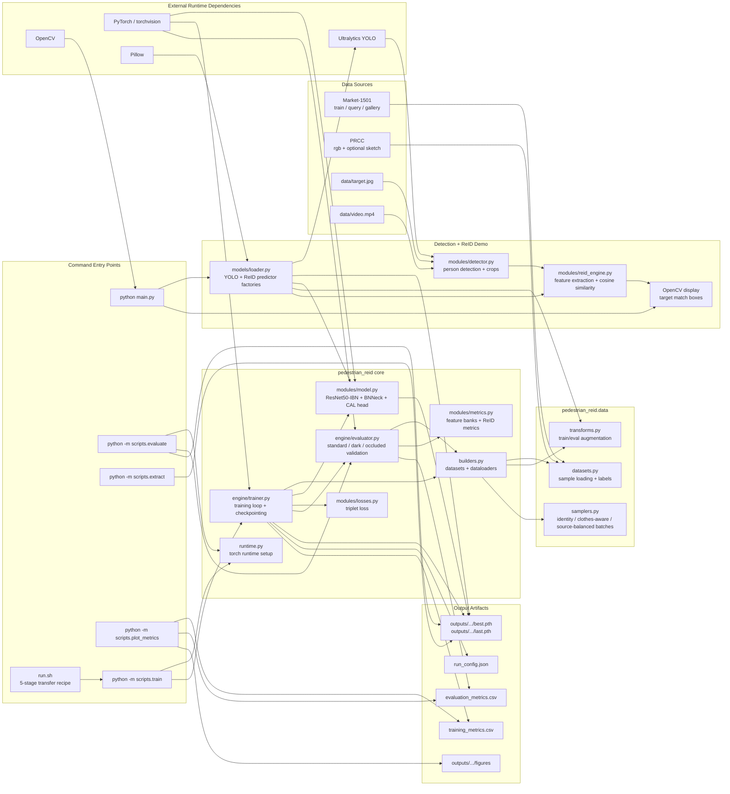

# Project Architecture

## Legend

- Training path: `scripts.train` builds datasets/loaders, trains `PedestrianReIDNet`, evaluates periodically, and writes checkpoints plus metrics.
- Evaluation path: `scripts.evaluate` loads a checkpoint and reports standard, dark-query, and occluded-query retrieval metrics.
- Demo path: `main.py` detects people with YOLO, extracts ReID features from each crop, compares them with the target image by cosine similarity, and renders matched boxes with OpenCV.
